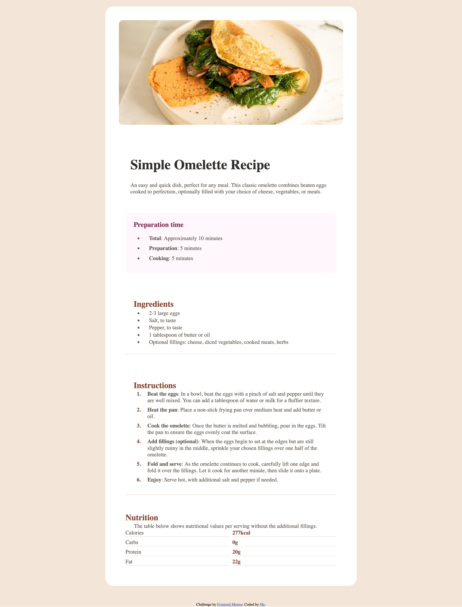
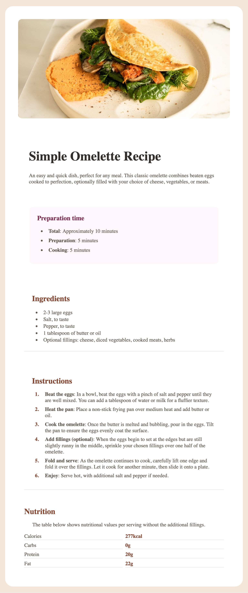
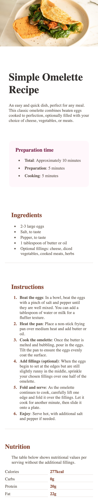

# Frontend Mentor - Recipe page solution

This is a solution to the [Recipe page challenge on Frontend Mentor](https://www.frontendmentor.io/challenges/recipe-page-KiTsR8QQKm). Frontend Mentor challenges help you improve your coding skills by building realistic projects. 

## Table of contents

  - [Overview](#overview)
  - [Screenshot](#screenshot)
  - [Built with](#built-with)
  - [What I learned](#what-i-learned)
  - [Author](#author)
  - [Acknowledgments](#acknowledgments)

**Note: Delete this note and update the table of contents based on what sections you keep.**

## Overview

### Screenshot

### Links

- Solution URL: [Add solution URL here](https://your-solution-url.com)
- Live Site URL: [Add live site URL here](https://your-live-site-url.com)

### Built with

- Semantic HTML5 markup
- CSS custom properties
- Flexbox
- CSS Grid

### What I learned

To use max-width more often.

## Author

- Frontend Mentor - [@kindlypi8MCeN7](hhttps://www.frontendmentor.io/profile/kindlypi8MCeN7)

## Acknowledgments

[@Taylor-McNeil]
[@ahsanma]

I wanted to thanks @Taylor-McNeil, her solution lead me for a simplification of my code and @ahsanma response to her solution gave me the final tips about the "max-witdh:100%", before that i struggled to kept the image at a good ratio.
