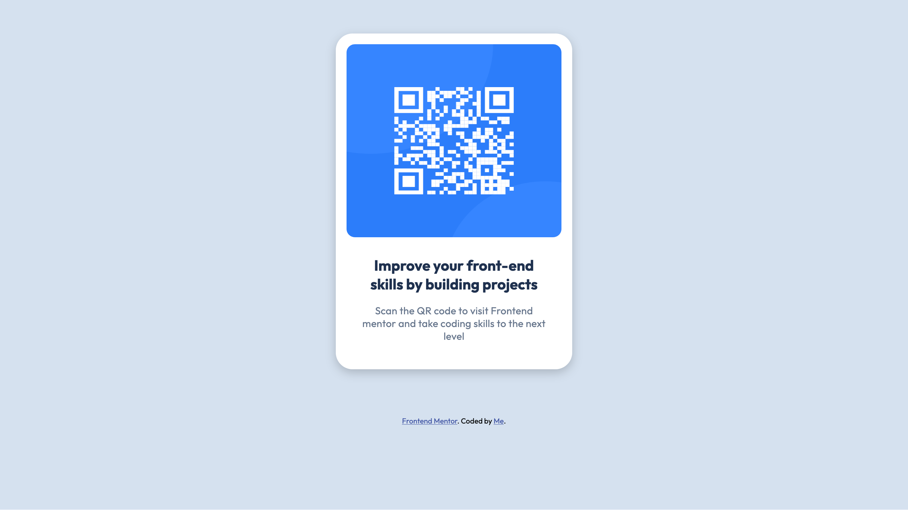

# Frontend Mentor - QR code component solution

This is a solution to the [QR code component challenge on Frontend Mentor](https://www.frontendmentor.io/challenges/qr-code-component-iux_sIO_H). Frontend Mentor challenges help you improve your coding skills by building realistic projects. 

## Table of contents

  - [Screenshot](#screenshot)
  - [Links](#links)
  - [Built with](#built-with)
- [Author](#author)
- [Acknowledgments](#acknowledgments)

## Screenshots

 - Fullscreen
 - mobile-screen

## Built with

- Semantic HTML5 markup
- CSS custom properties
- Flexbox
- CSS Grid
- [Styled Components](https://styled-components.com/) - For styles
- [Custom Font](https://fonts.googleapis.com/css2?family=Outfit:wght@100..900&display=swap") - For fonts

## Author
- Frontend Mentor [@kindlypi8MCeN7] (https://www.frontendmentor.io/profile/kindlypi8MCeN7)

## Acknowledgments

@saimasial-bit for her box-shadow for the card/container.

